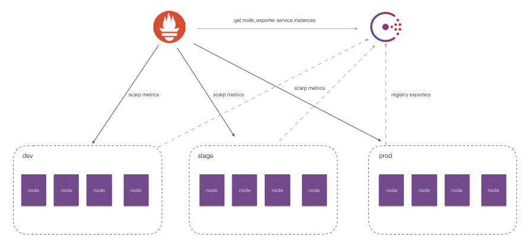

# 概述
优化监控和日志搜集的自动化！,并且增加服务的监控
## 监控与日志搜集
### 问题
目前线上的日志搜集和服务监控存在如下问题：

1. 每次新增加一个服务节点，必须在对应的promtail上面手动配置日志信息，并且要杀死promtail进程，然后重启promtail
2. 每次添加一个对应节点的监控exporter，必须手动的在prometheus进行配置，然后reload操作下

### 解决方案
#### 服务发现的配置
在promtail和prometheus当中都存在一个配置信息为：
```yml
....省略
scrape_configs:
  - job_name: '测试通过consule发现抓取日志'
  #手动编写抓取指标或者是日志的配置信息，目前线上采用的
  static_configs:
    - [<static_config>]
  #通过文件的形式配置，也就是引入一个文件的意思，然后配置刷新时间，例如5s
  file_sd_configs:
    - [<file_sd_configs>]

  #k8s本身提供了服务发现，直接从k8s读取这些pod和service的信息
  kubernetes_sd_configs:
    - [<kubernetes_sd_config>]
  #通过服务发现注册主键consul来获取
  consul_sd_configs:
    [ - <consul_sd_config> ... ]
  #另外一种形式的consul，目前怎么使用暂时未知，但是还是需要consul服务，估计是一种代理的形式
  consulagent_sd_configs:
    [ - <consulagent_sd_config> ... ]
```
总结下，promtail和promtheus支持一下的服务发现：

1. 手动修改配置(目前线上在用的)
2. 读取本地文件(还是需要自己手动修改文件，做不到自动化)
3. 通过k8s提供的服务发现功能(集群需要是k8s管理的才行)
4. 通过consul这个服务发现来发现服务

综合考虑运维的自动化，以及微服务的特性(容易启停节点，并且水平扩展)，现在考虑使用consul的方式来处理服务发现，让promtail和promtheus自动化处理自己的任务！如图：


下面只介绍consul的探索处理，其他几种不做处理了！
### Promtail配置consul
#### 之前的配置方式
```yml
server:
  http_listen_port: 9080 #promtail的http端口地址
  grpc_listen_port: 0
positions:
  filename: ./positions.yaml #记录当前日志采集状态的文件地址(promtail自动生产)
clients:
  - url: http://172.30.51.147:3100/loki/api/v1/push #采集的日志投递loki的地址
scrape_configs:
- job_name: 147-fgmp-service-5g
  static_configs:
  - targets:
      - localhost
    labels: #标签
      job: 147-fgmp-service-5g
      __path__: /home/fgmp/service/fgmp-service-5g/logs/*

- job_name: 147-fgmp-service-base
  static_configs:
  - targets:
      - localhost
    labels: #标签
      job: 147-fgmp-service-base
      __path__: /home/fgmp/service/fgmp-service-base/logs/*
......后面基本上是同样的配置信息，不做展开了
```

#### 使用consul的配置之后
```yml
server:
  http_listen_port: 9080 #promtail的http端口地址
  grpc_listen_port: 0
positions:
  filename: ./positions.yaml #记录当前日志采集状态的文件地址(promtail自动生产)
clients:
  - url: http://172.16.16.37:3100/loki/api/v1/push #采集的日志投递loki的地址

scrape_configs:
  - job_name: '测试通过consule发现抓取日志' #任务的名字
    consul_sd_configs: #consul配置
      - server: '172.16.16.46:8500'  #consul的服务配置地址 
        tag_separator: ',' #tag分隔符号，可以不配置
    relabel_configs: #重写标签来做转换获取到的services的处理
      - source_labels: [__meta_consul_service_metadata_path]
        target_label: __path__
        action: replace
      - source_labels: [__meta_consul_service]
        target_label: service
        action: replace
```


### Promtheus配置consul
#### 之前的配置
```yml
global:
  scrape_interval: 15s 
  evaluation_interval: 15s 
# 报警模块的配置
alerting:
  alertmanagers:
    - static_configs:
        - targets:
           - 172.30.51.147:7093
rule_files:
  - "rules/*.yml"
scrape_configs:
  - job_name: "prometheus(8.134.71.216)"
    static_configs:
      - targets: ["localhost:7090"]
  - job_name: "服务器监控指标数据"
    static_configs:
      - targets: ["172.30.51.147:7049","172.30.51.151:7049","172.30.51.148:7049","172.30.51.153:7049","172.30.51.154:7049","172.30.51.149:7049","172.30.51.152:7049","172.30.51.150:7049"]
  - job_name: 'process'
    static_configs:
      - targets: ["172.30.51.147:7256","172.30.51.151:7256","172.30.51.148:7256","172.30.51.153:7256","172.30.51.154:7256","172.30.51.149:7256","172.30.51.152:7256","172.30.51.150:7256"]
   ......等等，基本上都是这种手动配置

```

#### 修改之后的配置
```yml
global:
  evaluation_interval: 15s is every 1 minute.
alerting:
  alertmanagers:
  - static_configs:
    - targets:
       - 172.16.16.37:9093
rule_files:
  - "rules/*.yml"
scrape_configs:
  - job_name: '服务器基本信息'
    metrics_path: /metrics
    scheme: http
    consul_sd_configs:
      - server: 172.16.16.46:8500
        services:
          - node_exporter  
```

# 改造方案
## 服务进程归类与改造方案
|  服务   | 归类  | 改造方案|
|  ----  | ----  | ---- |
| 5G相关服务  | 使用了Nacos服务注册的都已经注册到Nacos上面，目前有channel和11y这些服务还没有注册到上面 | 使用nacos和consul的适配器来伪装consul|
| exporter  | 每个服务器上的各种exporter | 每次启动的时候，在启动脚本下面加上一行注册到consul的代码|
| 组件服务 | 例如nginx,rocketmq,nacos,等没有注册到Nacos上面| 使用Namesrv和Nacos的配置来做伪装的consul|

## 5G服务模块需要做的事情
1. 所有的服务需要注册到Nacos上面，目前缺少A11y,channel-xxx系列
2. 注册到Nacos的时候需要添加Metadata数据，增加一个logPath字段来标明自己的日志存储路径,方便promtail自动搜集日志

### 增加logPath的MetaData可以通过如下方式来处理
```java
@Bean
public NacosDiscoveryProperties nacosProperties() {
    NacosDiscoveryProperties nacosDiscoveryProperties = new NacosDiscoveryProperties();
    Map<String, String> metadata = nacosDiscoveryProperties.getMetadata();
    metadata.put("log.path", 获取日志路径);
    return nacosDiscoveryProperties;
}
```

# 服务监控
## 目标和目的
服务监控具备以下目标：

1. 获取Java进程的堆内存信息
2. 获取Java进程的CPU使用信息
3. 获取Java进程关于网络方面的信息(TCP连接数，收发网络流量统计)
4. 获取Java进程硬盘使用方面的信息(文件描述符号的使用)
5. 获取数据库连接池方面的信息(目前只支持Hakricp，后续看下其他的连接池是否可以手动获取指标数据)
## SpringBoot系列的服务监控
1. 引入jar依赖
```xml
<dependency>
    <groupId>org.springframework.boot</groupId>
    <artifactId>spring-boot-starter-actuator</artifactId>
</dependency>

<dependency>
    <groupId>io.micrometer</groupId>
    <artifactId>micrometer-registry-prometheus</artifactId>
</dependency>
```
2. application.yml配置暴露指标
```yml
management:
  metrics:
    tags:
      application: ${spring.application.name}
  endpoints:
    web:
      exposure:
        include: '*'
```

## 非SpringBoot类的服务监控
```xml
<!--Prometheus监控相关需要的Jar依赖,按照自己的需要添加对应的Jar-->
<!-- The client -->
<dependency>
    <groupId>io.prometheus</groupId>
    <artifactId>simpleclient</artifactId>
    <version>0.12.0</version>
</dependency>
<!-- Hotspot JVM metrics-->
<dependency>
    <groupId>io.prometheus</groupId>
    <artifactId>simpleclient_hotspot</artifactId>
    <version>0.12.0</version>
</dependency>
<!-- Exposition HTTPServer-->
<dependency>
    <groupId>io.prometheus</groupId>
    <artifactId>simpleclient_httpserver</artifactId>
    <version>0.12.0</version>
</dependency>
<!-- Pushgateway exposition-->
<dependency>
    <groupId>io.prometheus</groupId>
    <artifactId>simpleclient_pushgateway</artifactId>
    <version>0.12.0</version>
</dependency>
```

## 自定义监控指标
### Prometheus的指标数据类型简介

|  Metrics   | 解释  | 应用例子|
|  ----  | ----  | ---- |
| Counter  | 描述一些只增不减的数据| 例如：访问量，错误次数，正确次数了，登录次数了这种 |
| Gauge  | 瞬时值 | 例如内存占用，CPU使用率，磁盘使用率等等 |
| Histogram | 主要用于表示一段时间范围内对数据进行采样，主要用来统计数据的分布性| 例如http请求耗费的时间，一般按照直方图区间性质统计，因为有些长尾效应的数据会影响平均值|
|Summary|Histogram柱状图比较类似，主要用于计算在一定时间窗口范围内度量指标对象的总数以及所有对量指标值的总和| 例如统计某个时间段的http请求耗费的时间，或者是某个时间段做某个任务的时间|

### 统计某个http请求的数量自定义的指标
```java
@Component
public class CounterInterceptor extends HandlerInterceptorAdapter implements InitializingBean {
    private Counter counter;

    @Autowired
    private MeterRegistry meterRegistry;

    @Override
    public boolean preHandle(HttpServletRequest request, HttpServletResponse response, Object handler) throws Exception {
        String requestURI = request.getRequestURI();
        if (requestURI.endsWith("department-tree")) {
            counter.increment();
        }
        return true;
    }

    @Override
    public void afterPropertiesSet() throws Exception {
        counter = meterRegistry.counter("department_tree", "status", "success");
    }
}
```